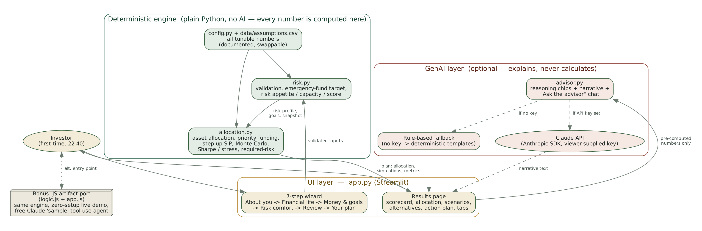

# Architecture

## Three layers, deliberately separated

**1. UI layer — `app.py` (Streamlit).** A 7-step wizard (How it works → About you →
Financial life → Money & goals → Risk comfort → Review → Your plan) collects inputs with
conditional disclosure (e.g. the sole-earner checkbox only appears once dependents > 0).
It calls the engine once validated inputs exist, and renders the results page.

**2. Deterministic engine — `risk.py` + `allocation.py` (plain Python + numpy, no AI).**
Every number a user sees — risk score, emergency-fund target, asset allocation, SIP amount
required, Monte Carlo outcome ranges, Sharpe ratio — is computed here by ordinary code
against the assumptions in `config.py` / `data/assumptions.csv`. This layer is unit-tested
independently of the UI (`test_engine.py`) and is 100% reproducible for the same inputs.

**3. GenAI layer — `advisor.py` (optional).** Takes the engine's *already-computed* numbers
and turns them into plain-English reasoning chips and a narrative, and answers follow-up
questions in the "Ask the advisor" tab. If an Anthropic API key is set server-side (an
environment variable / deployment secret — the app itself never asks a visitor for one), it
calls the Claude API; if not, it falls back to a deterministic rule-based template that
produces an equivalent (if less fluent) explanation. **The AI never performs a calculation**
— it only explains numbers the engine already produced. This separation is the single most
important design decision in the project: it means the financial outputs never depend on
what a language model decides, which matters for an investing tool.

## Why this shape

- **Auditability.** A grader (or a real investor) can check every number against `risk.py`/
  `allocation.py` without needing to trust an LLM's arithmetic — LLMs are well known to be
  unreliable at multi-step numeric computation.
- **Works with zero cost.** Because the AI layer is optional and sits behind a fallback, the
  app is fully functional, and gradeable end-to-end, without anyone paying for an API key.
- **Testability.** The deterministic engine can be tested in isolation (fast, no network,
  no AI variance) and the full UI can be tested separately via Streamlit's `AppTest`
  framework — see `TEST_REPORT.md`.

## Bonus: the JS artifact (zero-setup live demo)

Alongside the Python app, `logic.js` is a faithful line-for-line JavaScript port of
`risk.py` + `allocation.py` (verified against the same test cases, see `TEST_REPORT.md`),
wrapped in a self-contained wizard UI (`app.js`) and published as a Claude Artifact — a
link that opens and works instantly, with no install step. Its "Ask the advisor" tab goes
one step further architecturally: instead of a narrator bolted on after the fact, Claude is
given **tools** onto the page's own engine (`estimate_required_return`, `get_goal_status`)
and decides for itself when to call them while answering a free-text question — a genuine
agent pattern, not just a captioned calculator. It costs nothing to run: the call is billed
to the viewer's own Claude session, not to a project API key. See `AI_USE_DECLARATION.md`
for the full description of where AI is used and how it degrades gracefully when
unavailable.

## Data flow (one request)

1. User completes the wizard → `app.py` builds a plain `dict` of validated inputs.
2. `risk.py`: validates, builds goals (goal-specific inflation), computes the financial
   snapshot (income/expenses/EMI/emergency fund), and the risk appetite/capacity/score.
3. `allocation.py`: carves out any emergency-fund shortfall first, splits the remaining
   amount across goals by priority then date, computes each goal's required contribution,
   runs a seeded Monte Carlo simulation per goal per candidate profile (Conservative/
   Moderate/Aggressive), tilts the blended allocation for existing holdings, and computes
   Sharpe ratio, stress-decline, and the "required risk" advisory figure.
4. `app.py` renders the result; `advisor.py` is called (API or fallback) purely to narrate
   it in words.
